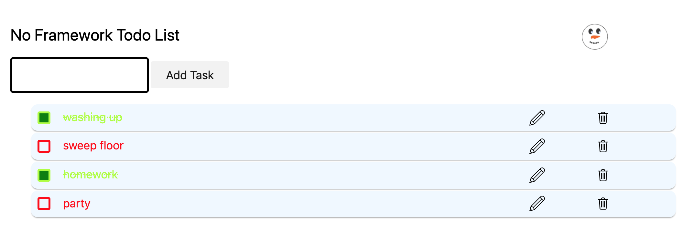

# no-framework-todo-list

# Introduction

It is very common for developers to ask "What Framework Should I use?"
On the front end in 2021 this might mean React, Angular, Vue or Svelte. In the past it was jQuery.

These frameworks offer a lot out of the box, but they also add unused download bloat, enforce certain structures (can be useful but discourages developer creativity) and puts a layer of abstraction between the developer and the web platform.

For developers one of the great attractions of frameworks is how much code they can save. 

So in this repo I want to explore how to efficiently create a todo list application with just plain old javascript. I've chosen a todo list application because it is a common example for many frameworks to show.

Currently the app has only **127 lines of js** code and is **< 5kb** download <u>uncompressed</u> (apart from a random winter decoration I added for my son.)

Compare this to the minified Vue.js framework (one of the better ones) which  is ~40kb out of the box before you write a single line of code. 

The no-framework approach does have drawbacks, but it means ultimately you will invest your time in learning how the web platform actually works and how to get more out of javascript by, creating useful abstractions that keep your work efficient. 

Ultimately you may decide that a framework is right for your project, but knowing how and when to work without one is a great asset to any developer. 

# Rules

No external JS frameworks or libraries. 

Note I started out by including the [tactic CSS library]([GitHub - yegor256/tacit: CSS Framework for Dummies, Without Classes](https://github.com/yegor256/tacit) which is a non opinionated library for just making raw html look ok. I may remove it later. 

## Current Screenshot

